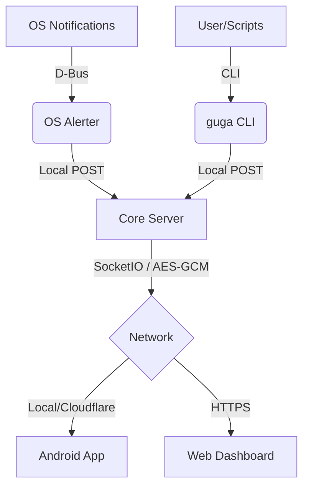

# GuGa Server — Technical Deep Dive

This document provides a comprehensive technical overview of the GuGa-Nexus backend. It is intended for developers, maintainers, or anyone looking to understand the inner workings of the system.

---

## 🏗️ System Architecture

GuGa is a distributed notification relay system. The architecture consists of three main local components interacting with a remote Android client:

1.  **Core Server (`server.py`)**: The central hub. It manages client sessions (browsers and Android apps), handles authentication (pairing), and provides a private REST/SocketIO interface for message ingestion.
2.  **OS Alerter (`os_notification_alerter.py`)**: A passive listener that monitors the Linux D-Bus for `org.freedesktop.Notifications`. When an OS notification is detected, it cleans the text and forwards it to the Core Server via a local POST request.
3.  **CLI Tool (`guga_push.py`)**: An active pusher. It allows users or scripts to manually trigger notifications. It handles both simple messages and "command watching" (monitoring a subprocess and notifying on completion).



---

## 📂 Project Structure (Technical)

| File / Directory | Purpose |
| :--- | :--- |
| `server.py` | Main application entry point. Handles Flask routes, SocketIO events, and device pairing logic. |
| `setup.py` | Environment initialization script. Detects package managers, installs system deps (dbus), and downloads `cloudflared`. |
| `os_notification_alerter.py` | Subprocess-based D-Bus monitor. Forwards desktop alerts to the server. |
| `guga_push.py` | The logic for the `guga` CLI tool. Uses only Python standard library where possible for maximum portability. |
| `trusted_devices.json` | Persistent store for paired device IDs, encryption tokens, and expiry timestamps. |
| `requirements.txt` | Python dependency list (Flask, SocketIO, Cryptography, python-dotenv). |
| `cloudflared` | (Generated) The Cloudflare Tunnel binary used for zero-config remote access. |
| `man/` | Contains the manual pages for the `guga` tool. |

---

## 🔐 Security Implementation

### End-to-End Encryption (AES-256-GCM)
Except for the initial pairing handshake, all data sent to Android apps is encrypted locally using **AES-256-GCM**.
- **Key Generation**: During pairing, a unique 256-bit hex token is generated via `secrets.token_hex(32)`.
- **Persistence**: This token is stored on the server in `trusted_devices.json` and on the phone in secure storage.
- **Payload**: Each message includes a random 12-byte IV and the base64-encoded ciphertext.

### Zero-Trust Handshake
Pairing follows a strict 8-digit PIN protocol:
1.  Device sends a `hello` with a unique ID.
2.  Server generates a random 8-digit PIN and prints it to the *physical terminal*.
3.  User enters the PIN on the device.
4.  If the PIN matches, the server issues a long-lived hex token.

### Network Isolation
- The `/send` route (used by the Alerter and CLI) only accepts requests from `127.0.0.1` or `::1`.
- This ensures that only local processes can "push" notifications to your phone.

---

## 📡 D-Bus Alerter Logic

The `os_notification_alerter.py` script spawns `dbus-monitor` as an asynchronous subprocess. It filters specifically for:
`interface='org.freedesktop.Notifications', member='Notify'`

It uses a state-machine parser to extract the **App Name**, **Summary (Title)**, and **Body** from the multi-line D-Bus output. It also includes a `clean_text` utility to strip HTML tags and Markdown formatting that some Linux desktop environments include in notifications.

---

## ⚙️ Environment Configuration (`.env`)

The server and its adapters read configuration from `server/.env`.

| Key | Type | Default | Description |
| :--- | :--- | :--- | :--- |
| `PORT` | `int` | `6769` | The port the Flask/SocketIO server listens on. |
| `MODE` | `str` | `public` | `lan` for local network only, or `public` to spawn a Cloudflare Tunnel. |
| `ENABLE_OS_NOTIFICATIONS` | `bool` | `False` | Whether `server.py` should automatically spawn the Alerter subprocess. |
| `ALERTER_SERVER_URL` | `url` | `http://localhost:6769/send` | The endpoint the Alerter targets. |
| `GUGA_VERBOSE` | `bool` | `false` | Enable detailed debug logging (encryption/decryption traces). |

---

## 🛠️ Development & Maintenance

### 🔍 Logging & Debugging
The server uses a structured event logging system. To see more detailed information, including raw SocketIO traffic and encryption/decryption traces, set the `GUGA_VERBOSE` environment variable:

```bash
GUGA_VERBOSE=true python server.py
```

#### Event Symbols
| Symbol | Meaning |
| :--- | :--- |
| `✓` | Success (e.g., device paired) |
| `✗` | Error / Failure (e.g., PIN rejected, decrypt failed) |
| `↑` | Connected (New session established) |
| `↓` | Disconnected (Session ended) |
| `→` | Command (Received phrase to process) |
| `↩` | Reconnected (Known device identified) |
| `⚠` | Warning (e.g., token expired, tunnel fallback) |

### Resetting All Trust
To revoke access for all devices, simply delete `trusted_devices.json` and restart the server.

### Adding New Commands
The `process_command` function in `server.py` is the hook for adding remote execution capabilities. Currently, it acts as a placeholder for future feature expansion.
